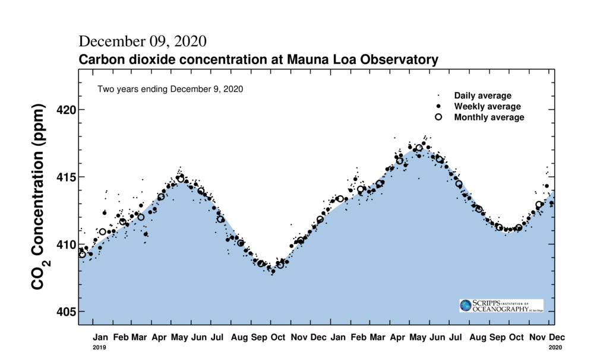
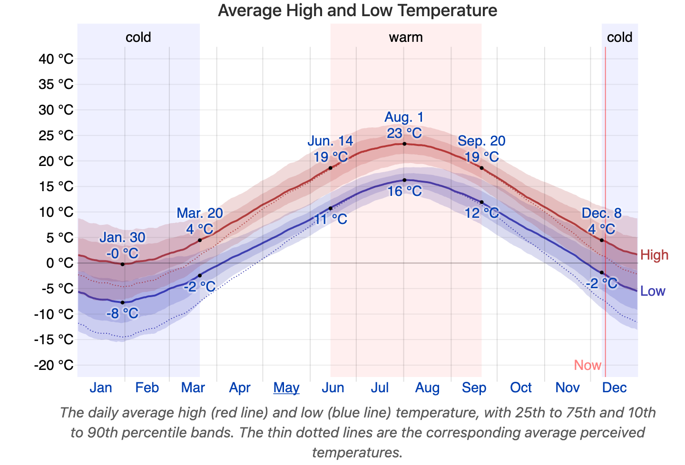

# Invitation to Data Visualization {#ch-invitation}

## Goals

In this lesson I will provide some examples of interesting and influential data visualizations.

## Atmospheric carbon dioxide concentration

Climate change over the coming century will be controlled by human-driven emission of carbon dioxide from fossil fuels into the atmosphere, and possibly our ability to remove it from the atmosphere. Starting in the 1950s, the amount of carbon dioxide in the atmosphere (in parts per million) was regularly measured. Subsequently, methods for analyzing gasses trapped in ice were used to extend this record back about one million years. There is a direct physical link between atmospheric concentration of carbon dioxide and the loss of heat from Earth to space, resulting in a mechanistic link between increasing carbon dioxide concentration in the atmosphere and the mean temperature of the surface of the Earth. Visualizations of this data and assocated global mean temperature data have been extremely influential, forming the [cornerstone of books](https://en.wikipedia.org/wiki/The_Hockey_Stick_and_the_Climate_Wars), a [documentary movie](https://en.wikipedia.org/wiki/An_Inconvenient_Truth), and countless educational and environmental change movements.

The two graphs below show carbon dioxide concentrations (in parts per million) in the atmosphere measured from a high-altitude observatory on the island of Hawai'i. The first graph shows two years of data. The second graph shows the monthly record since regular observations began.

```{r echo=FALSE,  out.width = '100%'}
#| fig-cap: "Two years of atmospheric CO$_2$ concentration from Mauna Loa observatory. Source [co2.earth](https://www.co2.earth/daily-co2) and [keelingcurve.ucsd.edu](https://keelingcurve.ucsd.edu/). "
#| label: fig-co2-2-year

```

```{r echo=FALSE, out.width='100%'}
#| fig-cap: "Atmospheric CO$_2$ concentration from Mauna Loa observatory, 1958 to present. Source [co2.earth](https://www.co2.earth/daily-co2) and [keelingcurve.ucsd.edu](https://keelingcurve.ucsd.edu/). "
#| label: fig-co2-full-record
knitr::include_graphics("static/mlo_full_record.png")
```

Two signals are immediately clear:

* there is an annual cycle in the CO$_2$ concentration and
* there is a yearly increase in CO$_2$ concentration, and this increase has been gradually increasing over the past 60 years.

A related graph, with a contrasting format shows the annual cycle of sea ice in the Arctic over the past 40 years.

. Graphic by Zachary Labe \@ZLabe.](static/sea-ice-volume.png){#fig-sea-ice}

Sample [visualizations of atmospheric carbon dioxide](https://scrippsco2.ucsd.edu/data/atmospheric_co2/primary_mlo_co2_record.html) which are regularly updated are available from the institute that has been collecting this data for decades.

The closely related data of estimated [global mean temperature](https://climate.nasa.gov/vital-signs/global-temperature/) over time are available from NASA.

Many other sites have information on these data, usually presenting [data visually](https://www.climate.gov/news-features/understanding-climate/climate-change-atmospheric-carbon-dioxide) as a testament to the importance of visualizations.

## Human health and development

[Hans Rosling](https://en.wikipedia.org/wiki/Hans_Rosling) was a physician and popularizer of data visualizations to develop understanding of human health and economic development over time and across countries. His [public presentations](https://www.ted.com/talks/hans_rosling_the_best_stats_you_ve_ever_seen) illustrate his view of how dyanmic charts can help us come to see the trajectory of global development, particularly the connections between health and economic development. I strongly encourage you to watch one of his [presentations](https://www.ted.com/talks/hans_rosling_the_best_stats_you_ve_ever_seen). He was especially well known for his effort to dispell misunderstandings about differences across countries in health and human development. He popularized a style of scatterplot which combined the use of colour, symbol size, and animations to show changes over time.

```{r echo=FALSE, out.width = '100%'}
#| fig-cap: "Fertility rate (babies per woman) as a function of median national income across countries. See the animated version showing how this relationship has changed over time in the video linked above. Source [gapminder.org](https://gapminder.org)"
#| label: fig-gapminder-fertility
knitr::include_graphics("static/gapminder-fertility-income.png")
```

## Weather

Many people are strongly interested in their local weather conditions. As a result of this strong interest and the complextity of the data, many visualizations have been developed. Forecasts, such as those produced by [Environment Canada](https://weather.gc.ca/en/location/index.html?coords=44.649,-63.602), and historical retrospectives, such as those produced by [Weatherspark](https://weatherspark.com/y/28434/Average-Weather-in-Halifax-Canada-Year-Round) are examples that leverage familiarity with the data, broad-scale human interest, and data-rich but not overly complicated displays. Two examples are shown below.

```{r echo=FALSE, out.width = '100%'}
#| fig-cap: "Environment Canada weather forecast for Halifax NS, December 10, 2020"
#| label: fig-env-canada-weather
knitr::include_graphics("static/env-canada-halifax-snapshot.png")
```

```{r echo=FALSE, out.width = '100%'}
#| fig-cap: "Climatological mean daily high and low temperatures in Halifax NS from weatherspark.com"
#| label: fig-weatherspark

```

Note that each image contains a wealth of data:

* current weather conditions and forecasts of weather conditions, high temperature for 12 days, 
* average historical daily highs and lows throughout the year, plus information on the quantiles of the temperature distribution on each day (shaded regions), some annotations showing high and low temperatures on selected days, and comparative descriptive labels (cold, warm, and neither).

## Journalism

In the past decade there has been a resurgence of interest in data visualizations, stimulated in part by journalists emphasising visualizations in their publications. This example in the New York Times shows [projected earnings for college graduates in a range of fields of study](https://www.nytimes.com/2018/01/04/learning/whats-going-on-in-this-graph-jan-9-2018.html) and is accompanied by notes and discussion questions. The New York Times has a series of educational materials on both [visualizations and their stories](https://www.nytimes.com/column/whats-going-on-in-this-graph).

{#fig-nyt-career-earnings}

## Historically important visualizations

Many ideas in contemporary data visulizations can be traced back to the 18th and 19th centuries, as represented by several impactful examples. In the late 18th century [William Playfair](https://en.wikipedia.org/wiki/William_Playfair) introduced a wide range of visualizations including bar charts, time series line plots, and pie charts. In 1869, Charles Minard produced a map of [Napoleon's Russian campaign of 1812](https://en.wikipedia.org/wiki/Charles_Joseph_Minard#The_map_of_Napoleon's_Russian_campaign). Florence Nightingale was a pioneer user of data visualizations to communicate messages about sanitation and public health, famously in a [polar histogram showing causes of mortality of soldiers](https://en.wikipedia.org/wiki/Florence_Nightingale#Statistics_and_sanitary_reform). Also in public health, John Snow mapped a cholera outbreak in London, [visually linking deaths to a water source](https://en.wikipedia.org/wiki/John_Snow#Cholera). All of these visualizations were great advances over the [bills of mortality](https://en.wikipedia.org/wiki/Bills_of_mortality) produced a few centuries earlier.

## Stories

A common observation is that humans [learn from stories](https://en.wikipedia.org/wiki/Storytelling#Storytelling_and_learning). What is the role of data and its visualization in story telling? A graph does not tell a story by itself, but a story can be woven from a combination of words and some data visualizations.

Wilke's book has an excellent argument in favour of [storytelling with data](https://clauswilke.com/dataviz/telling-a-story.html) which he tells in a [video](https://www.youtube.com/watch?v=g-AzIYsyqvo) (starting at time 6:42). His essential elements of a story are an arc including an opening, challenge, action, and resolution, which results in an emotional reaction such as excitement, curiosity or surprise. The principle is that the emotional response from the resolution of the challenge gets your audience engaged and helps them retain your message.

It may seem to you that a graph is far removed from a story. In fact, a single graph rarely tells a story on its own. A pair of graphs, or a dynamic graph, or even just an original graph and an updated graph can be used to tell a story. For example, return to the carbon dioxide figures at the top of this lesson. Two years of data show a seasonal cycle in atmospheric carbon dioxide with a modest year over year trend. Suppose that was all you knew about carbon dioxide. It would be hard to know why there was a problem. Now look at the record since 1958. It's now clear that there is a long-term increase and the interannual variation is small in comparison. The [800,000 year record from ice cores](https://www.climate.gov/news-features/understanding-climate/climate-change-atmospheric-carbon-dioxide) shown below provides even more context. Current atmospheric carbon dioxide concentrations are far outside the range of documented variability for the past 800,000 years.

{#fig-co2-800k-record}


We will return to the theme of story telling frequently in the course, particularly in assignments.

## Exercises

* Compare the presentation of data in the carbon dioxide and sea ice volume graphs. Which is easiest for you to understand? Why?
  * Predict how CO$_2$ over time would look if plotted in the style of the sea ice volume graph. Do the reverse prediction too. Return to this task later in the course once you have some more data manipulation and plotting skills.
* Which visualization from this lesson is most appealing? Most easily understood? Least appealing? Hardest to understand? Try to draw some conclusions about what you think "works" in a visualization.

## Futher reading

- Kurt Vonnegut summary of [story arcs](https://www.openculture.com/2014/02/kurt-vonnegut-masters-thesis-rejected-by-u-chicago.html)
- @wilke2019fundamentals, in particular [Chapter 29](https://clauswilke.com/dataviz/telling-a-story.html).
- A course about [Data Visualization](https://wilkelab.org/SDS375/) in R by Claus Wilke.

```{r echo=FALSE}
source("helper.R")
writePackages(erase=TRUE)
```
