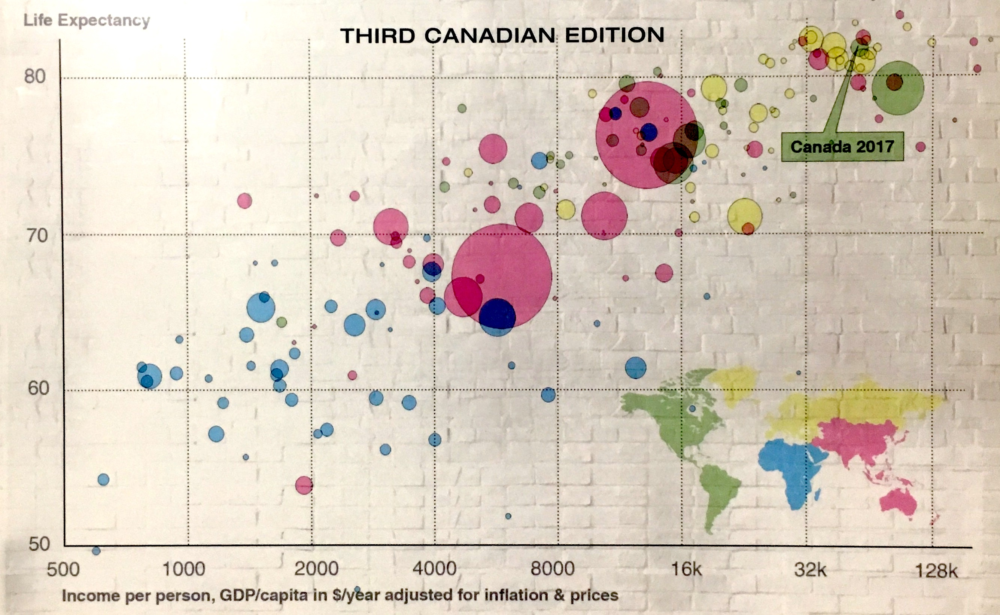

# Reconstructing a visualization

```{r setup, include=FALSE}
knitr::opts_chunk$set(echo = TRUE)
library(ggrepel)
library(rnaturalearth)
library(rnaturalearthdata)
library(rgeos)
library(tidyverse, quietly = TRUE)
```

## Goal

In this lesson we will find a visualization and try to reconstruct it using R.

A reasonable challenge is to redraw a version of the [textbook](https://www.google.ca/books/edition/Stats/muxnswEACAAJ) cover for STAT 1060 [@DeVeaux] using the `gapminder` data.

{#fig-book-cover}

## Starting out

Get the gapminder data, take the last year's data (2007) and make a scatter plot:

The last year with data is 2007, so let's take those data and make a scatterplot.
```{r}
gapminder |> 
  filter(year == 2007) |>
  ggplot(aes(y=lifeExp,
             x=gdpPercap)) + 
  geom_point() 
```

Change the x-axis to have a log scale. We can even use the log-2 scale.

```{r, eval=FALSE}
gapminder |>
  filter(year == 2007) |>
  ggplot(aes(y=lifeExp,
             x=gdpPercap)) + 
  geom_point() + 
  scale_x_continuous(trans = "log2",
                     breaks = c(250, 500, 1000, 2000, 4000, 8000, 16000, 32000, 64000)) 
```

Here's a version with the abbreviated labels (16k) used on the cover, but avoiding the mistake of labelling 64k as 128k (neither appear on our graph).

```{r, eval=FALSE}
gapminder |>
  filter(year == 2007) |>
  ggplot(aes(y=lifeExp,
             x=gdpPercap)) + 
  geom_point() + 
  scale_x_continuous(trans = "log2",
                     labels = c("250", "500", "1000", "2000", "4000", "8000", "16k", "32k", "64k"),
                     breaks = c(250, 500, 1000, 2000, 4000, 8000, 16000, 32000, 64000)) 
```


We should clean up the axis names:

```{r, }
gapminder |> filter(year == 2007) |>
  ggplot(aes(y=lifeExp, x=gdpPercap)) + 
  geom_point() +
  scale_x_continuous(trans = "log2") +
  xlab("Income per person, GCP/capita in $/year adjusted for inflation and prices") + 
  ylab("") + 
  ggtitle("Life Expectancy (2007)") 
```

## Colour and symbol sizes

First colour from the continent name:

```{r, }
gapminder |> filter(year == 2007) |>
  ggplot(aes(y=lifeExp, x=gdpPercap, color=continent)) + 
  geom_point() +
 scale_x_continuous(trans = "log2") +
  xlab("Income per person, GCP/capita in $/year adjusted for inflation and prices") + 
  ylab("") + 
  ggtitle("Life Expectancy (2007)") 
```

Add transparency, and outline around the points, match the colour to the book. Use population size to adjust the size of the dots.

```{r}
gapminder |> filter(year == 2007) |>
  ggplot(aes(y=lifeExp, x=gdpPercap, color=continent, size = pop)) + 
  geom_point(alpha=0.5) +
  geom_point(shape=1, color="black") +
  scale_x_continuous(trans = "log2") +
  xlab("Income per person, GCP/capita in $/year adjusted for inflation and prices") + 
  ylab("") + 
  ggtitle("Life Expectancy (2007)") +
  scale_color_manual(values = c("blue", "green", "pink", "yellow", "red")) 
```

Scale the points by setting a maximum size. Remove the legend.

```{r}
gapminder |> filter(year == 2007) |>
  ggplot(aes(y=lifeExp, x=gdpPercap, color=continent, size=pop)) + 
  geom_point(alpha=0.5) +
  geom_point(shape=1, color="black") +
  scale_x_continuous(trans = "log2") +
  xlab("Income per person, GCP/capita in $/year adjusted for inflation and prices") + 
  ylab("") + 
  ggtitle("Life Expectancy (2007)") +
  scale_color_manual(values = c("blue", "green", "pink", "yellow", "red")) +
  scale_size_area(max_size = 20) +
  theme(legend.position = "none")
```

## Inset map

Make a map.

```{r,fig.height=4, fig.width=8}
world <- ne_countries(scale='medium',
                      returnclass = 'sf')
world |>
  ggplot() + 
  geom_sf(aes(fill=continent))
```

Remove Antarctica and match colours:

```{r,fig.height=5, fig.width=8}
world |> filter(continent != "Antarctica") |>
  ggplot() + geom_sf(aes(fill=continent)) +
    scale_fill_manual(values = c("blue", "pink", "yellow","green", "red", "black", "green" )) 
```

Remove outlines, add transparency, remove legend.

```{r,fig.height=5, fig.width=8}
world |> filter(continent != "Antarctica") |>
  ggplot() + geom_sf(aes(fill=continent), color=NA, alpha=0.5) +
  scale_fill_manual(values = c("blue", "pink", "yellow","green", "red", "black", "green" )) +
  theme(legend.position = "none")
```

Remove the grid and background and axis labels:

```{r,fig.height=5, fig.width=8, fig.align='center'  }
world_map <- world |> filter(continent != "Antarctica") |>
  ggplot() + geom_sf(aes(fill=continent), color=NA, alpha=0.5) +
    scale_fill_manual(values = c("blue", "pink", "yellow","green", "red", "black", "green" )) +
    theme_bw() + theme(legend.position = "none", panel.border=element_rect(linetype=0),
                     panel.grid = element_line(color=NA),
                     panel.background = element_rect(fill=NA),
                     plot.background = element_rect(fill=NA),
                     axis.text.x = element_text(color=NA),
                     axis.ticks.length =  unit(0, "cm")) 
world_map
```

## Combine plot and map

```{r}
gapminder |> filter(year == 2007) |>
  ggplot(aes(y=lifeExp, x=gdpPercap, color=continent, size=pop)) + 
  geom_point(alpha=0.5) +
  geom_point(shape=1, color="black") +
  geom_label_repel(aes(label=country), data = gapminder |> filter(year ==2007, country=="Canada"), color="black", fill="green", 
                   segment.size=1, segment.color="green", box.padding=3) +
  xlab("Income per person, GCP/capita in $/year adjusted for inflation and prices") + 
  ylab("") + 
  ggtitle("Life Expectancy (2007)") +
  scale_color_manual(values = c("blue", "green", "pink", "yellow", "red")) +
  scale_size_area(max_size = 20) + 
  annotation_custom(grob=ggplotGrob(world_map), xmin=12.3, ymin=35, ymax=50 ) +
  scale_x_continuous(trans = "log2",
                     labels = c("250", "500", "1000", "2000", "4000", "8000", "16k", "32k", "64k"),
                     breaks = c(250, 500, 1000, 2000, 4000, 8000, 16000, 32000, 64000)) +
  theme(legend.position = "none")  -> final_plot
final_plot
```


## Packages used

In addition to `tidyverse` and `gapminder`, in this lesson we used 

* `ggrepel`
* `rnaturalearth`
* `rnaturalearthdata`
* `rgeos`


```{r echo=FALSE}
source("helper.R")
writePackages()
```

## Exercise

Reconstruct the WeatherSpark visualization for a location in Canada using Environment Canada weather data.
